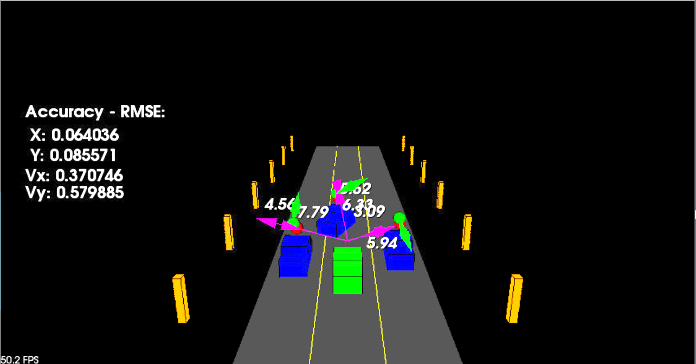

# Udacity: Sensor Fusion Nanodegree

## **Projects:**

_Tech_ - `C++`, `MATLAB`, `PCL`, `OpenCV`

### 1. [Lidar Obstacle Detection](LidarObstacleDetection/)

    Involves processing the LIDAR point cloud using `PCL` to identify cars and other obstacles apart from the road.

    Implemented custom RANSAC-based segmentation to separate the road from other obstacles.  

    Then defined a custom KD-Tree structure for efficient clustering of the LIDAR points, which are then collected in a bounding box to indicate the obstacles.

The resulting output looks like: 

### 2. [2D Feature Matching](2DFeatureMatching/)

    Conducted 2D feature tracking using different keypoint detectors and descriptors available in `OpenCV` library, and compared them to find the optimal pair.

    Comparison is done based on processing times and number of keypoint matches.

### 3. [3D Object Tracking](3DObjectTracking/)

    Combined LIDAR and Camera data to track objects in real-time. A YOLO object detection model is used to identify and segment individual objects. 

    Used 2D feature matching algorithms to match the identified objects across the video frames. Used this information to compute the Time-To-Collision (TTC).

    Also performed a comparison across the detectors and descriptors available in `OpenCV` based on processing times and TTC values.

### 4. [Radar Target Detection](RadarTargetDetectionCFAR/)

    Simulated an FMCW radar for target detection in `MATLAB`. 

    Used Range-Doppler estimation with CFAR to obtain accurate target localization.

### 5. [Unscented Kalman Filter](UnscentedKalmanFilter/)

    Combined the acquired sensor information from LIDAR and Radar.

    Implemented a complete Unscented Kalman Filter on LIDAR and RADAR datapoints to accurately estimate and track surrounding vehicles.

    Used CTRV model for vehicle tracking and obtained close estimates of the vehicle positions and velocities.

