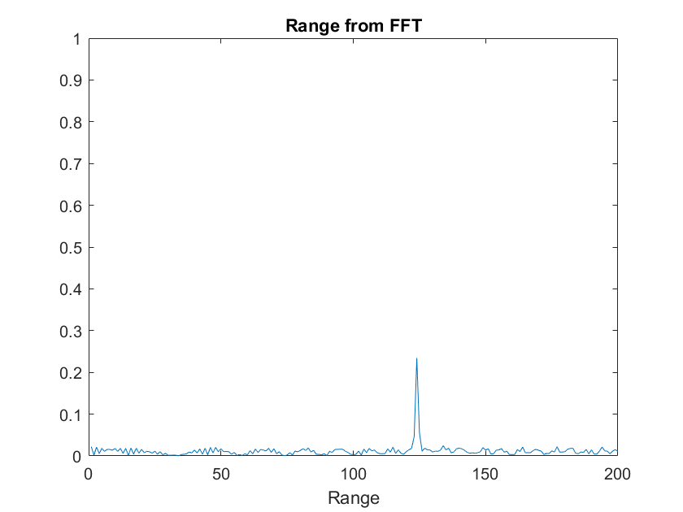
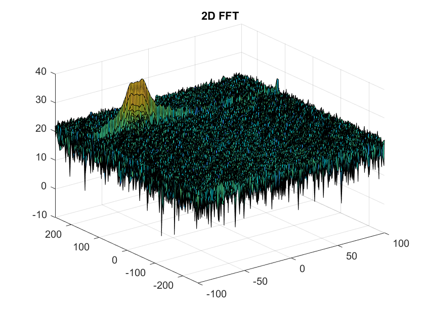
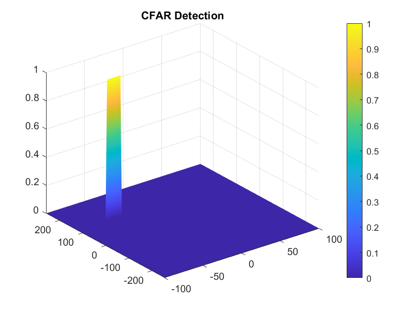

# Radar Target Generation and Detection

This project aims to implement radar-based target detection for a FMCW radar system.

## 2D CFAR

1. Created variable `signal_cfar` of the same size as RDM and calculated the total training cells.
2. Designed a sliding window with the training bands and the guard bands around the CUT.
3. Obtained total training cell (noise) by computing the difference of sums between the entire window and the guard window (including CUT).
4. Obtained the avg noise using the total noise with the precalculated number of training cells.
5. Converted the avg noise to dB and added the noise offset.
6. Set the value in `signal_cfar` based on the thresholded value the same cell in RDM.

### Selecting Training and Guard Cells

1. Started with an offset of 2 dB but this led to many false detections so slowly increased till a proper result.
2. Started with 9 Training cells in each dimension with 3 guard dimension. This led to a wide detection. So tweaked values till a proper output could be seen

## Outputs

#### Range FFT

#### 2D FFT

#### 2D CFAR

